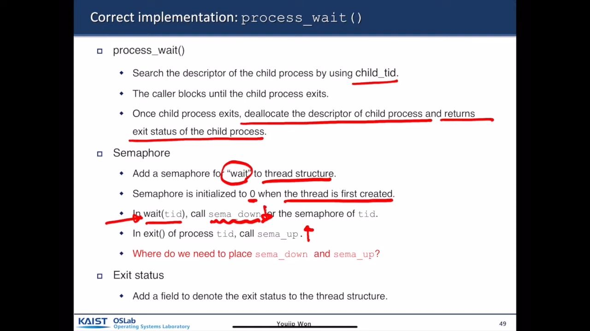

**[[Week04] Pintos Project2 systemcall](https://www.youtube.com/watch?v=sBFJwVeAwEk)**

---

AI Title: The system call handler must validate the address provided by the user program to ensure it is correct.

**3:52 [Play](https://app.videonotebook.com/public/video/cacf35be-de2c-4fca-b98c-faf595c15877?noteId=0189d052-fe09-44b9-ba37-f7719b3606a7&time=3:52&type=S)**

---

* validate it using “verify\_ptr()” that is in user space
* validate also that the address is valid (virtual address converted into physical address ) using conv\_addr etc..
* load arguments to kernel from user stack using load\_args()

**3:52 [Play](https://app.videonotebook.com/public/video/cacf35be-de2c-4fca-b98c-faf595c15877?noteId=8352fd1e-8804-4519-aa5a-d803addf07f7&time=3:52&type=T)**

---

AI Title: A page fault can be efficiently handled by modifying the code to rely on hardware for user verification, a method commonly used in operating systems like Linux.

**7:20 [Play](https://app.videonotebook.com/public/video/cacf35be-de2c-4fca-b98c-faf595c15877?noteId=60ab6a3e-bdf0-43c2-bf32-032c223258c9&time=7:20&type=S)**

---

AI Title: The first approach to memory management is simpler as the operating system handles verification of pointers, while the second approach is more complex due to the inability to return error codes from memory access.

**8:44 [Play](https://app.videonotebook.com/public/video/cacf35be-de2c-4fca-b98c-faf595c15877?noteId=af9d1495-d014-4ba4-ad13-50300d030415&time=8:44&type=S)**

---

AI Title: A thread structure should include a pointer to its parent process and pointers to its siblings, organized in a doubly linked list, while also allowing for various implementations of child pointers.

**10:59 [Play](https://app.videonotebook.com/public/video/cacf35be-de2c-4fca-b98c-faf595c15877?noteId=d2082747-9d61-4dcd-90fd-e80685ab62f4&time=10:59&type=S)**

---

added data structures for children and parent

**11:01 [Play](https://app.videonotebook.com/public/video/cacf35be-de2c-4fca-b98c-faf595c15877?noteId=10aed8b8-d164-4e7f-afda-8b9c092fb1a6&time=11:01&type=T)**

---

sema\_up and sema\_down in exit and wait syscalls

**14:13 [Play](https://app.videonotebook.com/public/video/cacf35be-de2c-4fca-b98c-faf595c15877?noteId=145fc9e1-344e-4459-a9fb-7a9af801b122&time=14:13&type=T)**

---

AI Title: Values are initialized to zero, and when a thread is created, the caller is blocked until the child process exits, which can increase a semaphore value and wake up waiting processes.

**14:32 [Play](https://app.videonotebook.com/public/video/cacf35be-de2c-4fca-b98c-faf595c15877?noteId=3659a70c-d0c1-41a7-b107-a5948fb093e3&time=14:32&type=S)**

---

AI Title: When a user process calls exit, it signals the semaphore to unblock any waiting processes, and the core functionality of Pentos combines fork and exec similar to Unix.

**15:31 [Play](https://app.videonotebook.com/public/video/cacf35be-de2c-4fca-b98c-faf595c15877?noteId=efa24959-61c8-4dc9-a34f-9a67a9db27c0&time=15:31&type=S)**

---

AI Title: The exec system call passes arguments to a program, returns the process ID of the new process, and does not wait for that process to complete loading.

**16:27 [Play](https://app.videonotebook.com/public/video/cacf35be-de2c-4fca-b98c-faf595c15877?noteId=914b7757-2858-417c-8a39-69a42c64c4a6&time=16:27&type=S)**

---

AI Title: A semaphore is added to the thread structure, initialized to zero, to synchronize the successful loading of a child process created by an exec system call.

**17:27 [Play](https://app.videonotebook.com/public/video/cacf35be-de2c-4fca-b98c-faf595c15877?noteId=b95ec883-d2ce-4c2f-be5e-432c80670454&time=17:27&type=S)**

---

AI Title: The decision needs to be made regarding the placement of the image-on function, either next to process execute or within the process itself.

**19:52 [Play](https://app.videonotebook.com/public/video/cacf35be-de2c-4fca-b98c-faf595c15877?noteId=e6f856e1-57d1-46da-9310-f29aca5fdfac&time=19:52&type=S)**

---

correct implementation + where to put sema\_down() for correctly checking that the process is loaded “put in exec() orr process\_execute()“

**20:05 [Play](https://app.videonotebook.com/public/video/cacf35be-de2c-4fca-b98c-faf595c15877?noteId=cd4509bf-fc15-48fd-abea-92416185ee7f&time=20:05&type=T)**

---

save the exit status in exit()

**20:44 [Play](https://app.videonotebook.com/public/video/cacf35be-de2c-4fca-b98c-faf595c15877?noteId=50172005-7b2a-43f9-90d2-25752ae76ad5&time=20:44&type=T)**

---

AI Title: A common function for thread exit involves storing the status of a process and allowing other processes waiting for that thread to receive the completion signal.

**21:20 [Play](https://app.videonotebook.com/public/video/cacf35be-de2c-4fca-b98c-faf595c15877?noteId=bd291e6a-361f-4511-b882-bba73850dfef&time=21:20&type=S)**

---
